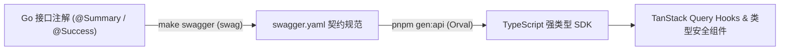

在前后端协同开发中,接口定义的高频变动通常是效率瓶颈:

- 业务管理后台中,每个数据实体均涉及标准 CRUD 接口的定义与前端调用层封装;
- 表单模型调整字段名称或增删属性,前端需同步更新对应的数据模型与请求方法。

在缺乏确定性契约的场景下,依赖人工同步或通过自然语言让模型阅读 Git Diff 修改代码,容易消耗额外上下文,且极易出现类型遗漏或字段漂移。

> [!TIP] 契约驱动与编译期防线
> 将 OpenAPI 契约作为前后端唯一的沟通事实来源(Single Source of Truth)。后端代码注解自动派生 `swagger.yaml`,前端 Orval 自动生成强类型 React Query SDK。类型漂移与重构中断全部在 `tsc` 编译期硬性拦截。



通过这一流程,接口文档与类型系统保持同步,大幅降低跨端交互的心智与通信成本。

---

## 契约同步流程与端到端实践

以一个发帖与点赞互动的社交场景为例:

> *"后端实现点赞与取消点赞接口;前端帖子详情页渲染红心按钮,支持点击状态切换与计数实时刷新。"*

前后端协作的核心依据,是由后端代码自动生成的 `swagger.yaml`。在 Go 处理函数上方配置结构化声明注解:

```go title="internal/api/likes.go"
// 获取我点赞的帖子
//
//	@Summary	获取我点赞的帖子
//	@Tags		likes
//	@Security	BearerAuth
//	@Param		page		query		int		false	"页码"		default(1)
//	@Param		page_size	query		int		false	"每页数量"	default(20)
//	@Success	200			{object}	render.Response[pageResponse[listPostsItemResponse]]
//	@Failure	500			{object}	render.errorResponse
//	@Router		/me/likes [get]
func (h *LikeHandler) ListLikedPosts(w http.ResponseWriter, r *http.Request) {
	// ...
}
```

`swag` 会解析这些注解,连同 `render.Response[T]` 泛型结构体中的字段与 `json` 标签,统一输出为标准 OpenAPI 契约文件。接口与注释位于同一源码文件中,变更天然保持一致。

通过 Makefile 构建契约:

```makefile title="Makefile"
swagger: swagger-fmt swagger-init

swagger-init:
	swag init -d internal/api,internal/pkg/render -g routes.go --parseInternal --v3.1 -ot yaml
```

执行 `make swagger` 后,在 `docs/swagger.yaml` 输出最新契约,将其同步至前端工程根目录。

---

## 前端强类型 SDK 自动生成

在前端工程根目录配置 `orval.config.ts`:

```typescript title="orval.config.ts"
import { defineConfig } from "orval";

export default defineConfig({
  bluebook: {
    input: {
      target: "./swagger.yaml", // 接口契约规范来源
    },
    output: {
      mode: "tags-split", // 按 @Tags 划分模块文件
      target: "src/api", // 输出生成目录
      client: "react-query", // 生成 TanStack Query Hooks
      httpClient: "axios", // 底层 HTTP 客户端
      formatter: "oxfmt", // 使用 oxfmt 进行输出排版
      override: {
        mutator: {
          path: "./src/mutator.ts", // 注入自定义 Axios 请求实例
          name: "customInstance",
        },
      },
    },
  },
});
```

运行 `pnpm gen:api`,所有接口自动派生为强类型代码,并按 Tag 进行模块归档:

```filetree
src/api/
├── api.schemas.ts      # 所有请求/响应的 TypeScript 类型定义
├── posts/
│   └── posts.ts        # 帖子模块: 请求函数 + QueryKey + React Query Hooks
├── likes/
│   └── likes.ts        # 点赞模块
└── users/
    └── users.ts        # 用户模块
```

每个接口展开为完整的强类型调用单元:

```typescript title="src/api/posts/posts.ts"
/**
 * Generated by orval 🍺
 * Do not edit manually.
 */

// 1. 强类型请求函数, 参数与返回值均具备类型推导
export const getPostsPostId = (postId: string, options?: SecondParameter<typeof customInstance>, signal?: AbortSignal) => {
  return customInstance<RenderResponseApiGetPostsResponse>(
    { url: `/posts/${postId}`, method: "GET", signal },
    options,
  );
};

// 2. QueryKey 生成器, 保障缓存清理的类型确定性
export const getGetPostsPostIdQueryKey = (postId: string) => {
  return [`/posts/${postId}`] as const;
};

// 3. 内置 TanStack Query Hook, 在组件内直接使用
export function useGetPostsPostId<TData, TError = RenderErrorResponse>(...) { ... }
```

---

### `mutator`:统一收口底层传输与拦截逻辑

代码生成器负责结构与类型映射,跨请求的业务通信特征(如统一响应解构、鉴权失效续期)则收口于 `mutator.ts`:

```text
// 统一返回包装规范示例
{
  "code": 200,
  "msg": "操作成功",
  "data": { ... }
}
```

针对双 Token 机制与全局错误拆包,可在 `src/mutator.ts` 中集中实现:

```typescript title="src/mutator.ts"
import Axios, {
  AxiosError,
  type AxiosRequestConfig,
  type AxiosResponse,
  type InternalAxiosRequestConfig,
} from "axios";

import { postAuthRefresh } from "@/api/auth/auth";

type ApiResponse = { code: number; msg: string; data?: unknown };
type RetriableRequestConfig = InternalAxiosRequestConfig & { _retriedAfterRefresh?: boolean };

const ACCESS_TOKEN_KEY = "access_token";
const REFRESH_TOKEN_KEY = "refresh_token";
const ME_KEY = "blue_book:me";
const UNAUTHENTICATED_AUTH_ENDPOINTS = new Set(["/auth/login", "/auth/register", "/auth/refresh"]);

export class ApiError extends Error {
  code: number;
  msg: string;
  data?: unknown;

  constructor(msg: string, code: number, data?: unknown) {
    super(msg);
    this.name = "ApiError";
    this.code = code;
    this.msg = msg;
    this.data = data;
  }
}

type ApiPayload<T> = T extends { data?: infer TData } ? TData : void;

export const AXIOS_INSTANCE = Axios.create({
  baseURL: "/api/v1",
});

function isUnauthenticatedAuthEndpoint(url?: string) {
  return UNAUTHENTICATED_AUTH_ENDPOINTS.has(url ?? "");
}

AXIOS_INSTANCE.interceptors.request.use((config) => {
  const token = localStorage.getItem(ACCESS_TOKEN_KEY);
  if (token && config.headers && !isUnauthenticatedAuthEndpoint(config.url)) {
    config.headers.Authorization = `Bearer ${token}`;
  }
  return config;
});

let refreshPromise: Promise<string> | undefined;

function clearSession() {
  localStorage.removeItem(ACCESS_TOKEN_KEY);
  localStorage.removeItem(REFRESH_TOKEN_KEY);
  localStorage.removeItem(ME_KEY);
  window.dispatchEvent(new Event("blue_book:session-expired"));
}

async function refreshAccessToken() {
  const refreshToken = localStorage.getItem(REFRESH_TOKEN_KEY);
  if (!refreshToken) throw new ApiError("登录已过期,请重新登录", 401);

  const auth = await postAuthRefresh({ refresh_token: refreshToken });
  if (!auth.access_token) throw new ApiError("登录凭证刷新失败", 401);

  localStorage.setItem(ACCESS_TOKEN_KEY, auth.access_token);
  if (auth.refresh_token) localStorage.setItem(REFRESH_TOKEN_KEY, auth.refresh_token);
  return auth.access_token;
}

async function retryAfterRefresh(config: RetriableRequestConfig) {
  if (config._retriedAfterRefresh || isUnauthenticatedAuthEndpoint(config.url)) {
    throw new ApiError("登录已过期,请重新登录", 401);
  }
  try {
    refreshPromise ??= refreshAccessToken().finally(() => {
      refreshPromise = undefined;
    });
    const token = await refreshPromise;
    config._retriedAfterRefresh = true;
    config.headers.Authorization = `Bearer ${token}`;
    return AXIOS_INSTANCE(config);
  } catch {
    clearSession();
    throw new ApiError("登录已过期,请重新登录", 401);
  }
}

// 统一响应与状态拦截
AXIOS_INSTANCE.interceptors.response.use(
  async (response: AxiosResponse<ApiResponse>) => {
    const { code, msg, data } = response.data;
    if (code < 200 || code >= 300) {
      const apiError = new ApiError(msg, code, data);
      if (code === 401) return retryAfterRefresh(response.config as RetriableRequestConfig);
      throw apiError;
    }
    return response;
  },
  async (error: AxiosError<ApiResponse>) => {
    if (error.response?.data) {
      const { code, msg, data } = error.response.data;
      if (code === 401 || error.response.status === 401) {
        return retryAfterRefresh(error.config as RetriableRequestConfig);
      }
      throw new ApiError(msg, code, data);
    }
    throw error;
  },
);

export const customInstance = <T>(
  config: AxiosRequestConfig | string,
  options?: AxiosRequestConfig,
): Promise<ApiPayload<T>> => {
  const requestConfig: AxiosRequestConfig =
    typeof config === "string" ? { url: config, ...options } : { ...config, ...options };
  return AXIOS_INSTANCE(requestConfig).then(({ data }) => data.data as ApiPayload<T>);
};

export default customInstance;
```

错误信封解析与 Token 静默刷新在网络层实现单点收口,上层调用无需编写防御样板代码。

---

## 业务组件实现与编译期校验

引入自动生成的 SDK 后,组件只需聚焦于状态流转与交互呈现:

```tsx title="src/routes/PostDetailPage.tsx"
import {
  useDeletePostsPostIdLike,
  useGetPostsPostId,
  usePutPostsPostIdLike,
} from "@/api/posts/posts";
import { ApiError } from "@/mutator";

const postQuery = useGetPostsPostId(postId);
const likeMutation = usePutPostsPostIdLike();
const unlikeMutation = useDeletePostsPostIdLike();
const post = postQuery.data;

const handleLike = async () => {
  if (!post) return;
  try {
    if (!post.viewer_liked) await likeMutation.mutateAsync({ postId });
    else await unlikeMutation.mutateAsync({ postId });
  } catch (err) {
    if (err instanceof ApiError) toast.error(err.msg);
  }
};
```

当后端将 `like_count` 字段重构为 `count` 时,仅需触发构建:

```bash title="契约同步与前端构建"
# 后端重新导出契约
make swagger
# 前端依据新契约生成 SDK 并执行类型检查
pnpm gen:api && pnpm build
```

TypeScript 编译器输出明确的不兼容定位:

```text
src/routes/PostDetailPage.tsx:87:30: error TS2339: Property 'like_count' does not exist on type 'RenderResponseApiGetPostsResponse'. Did you mean 'count'?
```

Agent 根据编译诊断清单即可完成针对性修复:

```diff title="src/routes/PostDetailPage.tsx"
- <span>{post.like_count} 点赞</span>
+ <span>{post.count} 点赞</span>
```

将跨端联调验证收敛为确定性的编译检查回路。

---

## Agent 提示词配置实践

在前端工程的 `package.json` 中配置生成脚本:

```json title="package.json"
{
  "scripts": {
    "gen:api": "orval"
  }
}
```

前端工程配置规范(`AGENTS.md`):

```markdown title="AGENTS.md (前端)"
### 前端 API 使用规范
1. `swagger.yaml` 是接口定义的唯一来源;运行 `pnpm gen:api` 重新生成 `src/api`。
2. 严禁手动修改或新增 `src/api` 目录下的任何文件,其归属自动化工具生成。
3. 所有数据请求必须调用 `src/api` 中生成的方法,禁止在组件中直接手写 `fetch` 或重复声明响应类型。
4. 请求异常优先展示 `ApiError.msg`。
```

后端工程配置规范:

```markdown title="AGENTS.md (后端)"
### 后端接口规范
1. 接口注解或响应类型变更后,必须执行 `make swagger` 重新生成 `docs/swagger.yaml`。
2. 注解统一使用泛型 `render.Response[T]`,保持 `@Success` 注释格式规范,避免声明松散的无类型结构。
```

---

## 契约驱动协同流水线

1. **后端注解声明**:Go Handler 顶部编写 OpenAPI 注解并绑定 `render.Response[T]` 泛型结构。
2. **导出契约规范 (`make swagger`)**:`swag` 静态分析 AST 导出最新的 `swagger.yaml` 规格文件。
3. **派生强类型 SDK (`pnpm gen:api`)**:Orval 自动生成按模块分类的 React Query Hooks 与 Schemas。
4. **端到端类型校验 (`pnpm build`)**:TypeScript 编译器执行全量类型断言,字段重构时直接输出行号级报错闭环。
{.steps}
